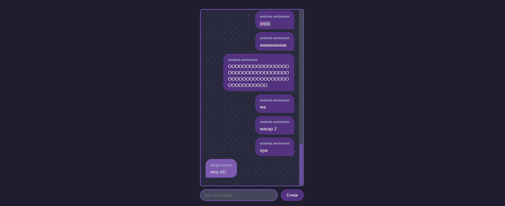

# Chat en Vivo con Node.js y Socket.io

Esta aplicación de **chat en vivo** permite la comunicación en tiempo real entre usuarios conectados a través de un servidor Node.js. Con una interfaz sencilla en HTML y CSS, este proyecto utiliza **Socket.io** para la comunicación bidireccional en tiempo real, junto con **Express** para el servidor, **Morgan** para el registro de solicitudes HTTP, y **dotenv** para la gestión de variables de entorno.

## Características

- **Chat en Tiempo Real**: Los mensajes enviados por un usuario son recibidos instantáneamente por todos los demás usuarios conectados.
- **Interfaz Sencilla**: La interfaz HTML y CSS proporciona una experiencia de usuario básica para enfocarse en la funcionalidad del chat.
- **Conexión Bidireccional con Socket.io**: Permite la comunicación en tiempo real y maneja múltiples conexiones simultáneas.
- **Registro de Solicitudes**: Morgan se encarga de registrar todas las solicitudes HTTP en la consola para un monitoreo eficaz.
- **Configuración con dotenv**: Utiliza dotenv para almacenar variables sensibles, como el puerto del servidor.

## Tecnologías Utilizadas

- **Node.js**: Plataforma de backend para la gestión de la aplicación del chat.
- **Socket.io**: Biblioteca para la comunicación en tiempo real entre cliente y servidor.
- **Express**: Framework para la creación del servidor HTTP.
- **Morgan**: Middleware de registro de solicitudes HTTP.
- **dotenv**: Herramienta para cargar variables de entorno desde un archivo `.env`.

## Capturas de Pantalla

### Pantalla Principal del Chat

La pantalla principal muestra el cuadro de chat, donde los mensajes de todos los usuarios conectados se actualizan en tiempo real.

### Vista de Ejemplo del Chat

A continuación, se muestra una vista de ejemplo de la interfaz del chat:

### Envío de Mensajes

Cada mensaje enviado por un usuario aparece en la ventana del chat en tiempo real para todos los demás usuarios.
